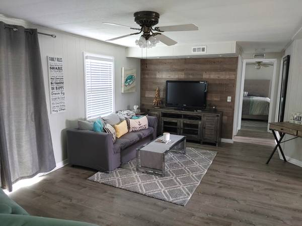
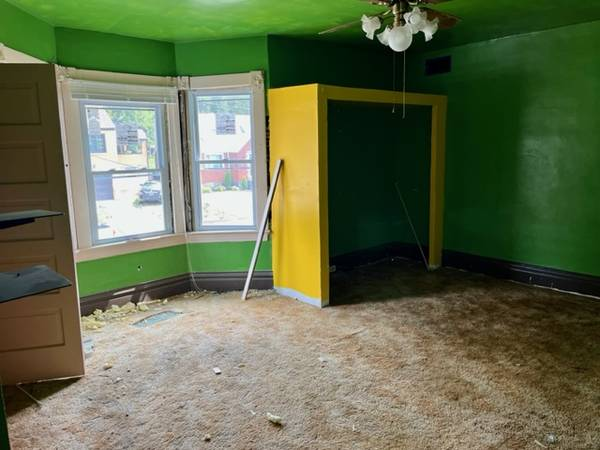
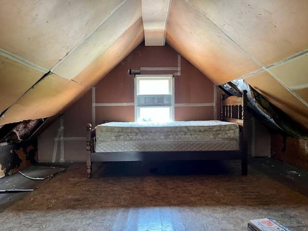
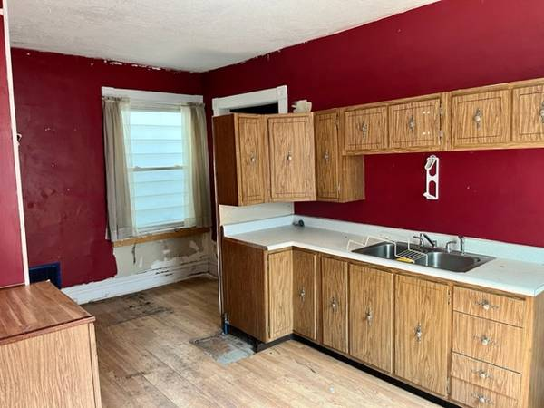

# Container 1 - Scraping container

Purpose is to scrape craigslist for images of `renovated` and `unrenovated` homes for training our CNN model.

Variables that we can specify in our code to modify our search criteria are:
- text keywords
- number of pages to scrape
- website link to scrape from

The code in this container, will output two folders: `renovated` and `fixer_uppers`.

Each of these folders will have subfolders within them, each representing a single house. Each subfolder will contain pictures of the home (ex: outside, living room, bathroom, etc)

## *Example Output Images.*

Below are example pictures from two houses, one is a renovated house, the other is a fixer-upper.

### Renovated Houses

<table>
  <tr>
    <td></td>
    <td></td>
    <td></td>
  </tr>
  <tr>
    <td></td>
    <td></td>
    <td></td>
  </tr>
</table>

### Fixer Uppers

<table>
  <tr>
    <td></td>
    <td></td>
    <td></td>
  </tr>
  <tr>
    <td></td>
    <td></td>
  </tr>
</table>

## Future work for MS3
- integrate distributed computing and cloud storage. For MS3, we will mount our Google Storage Buckets to the container, such that images are automatically downloaded into the buckets!