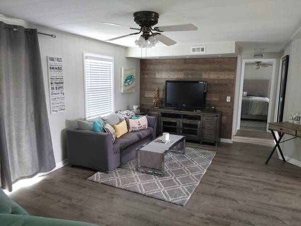
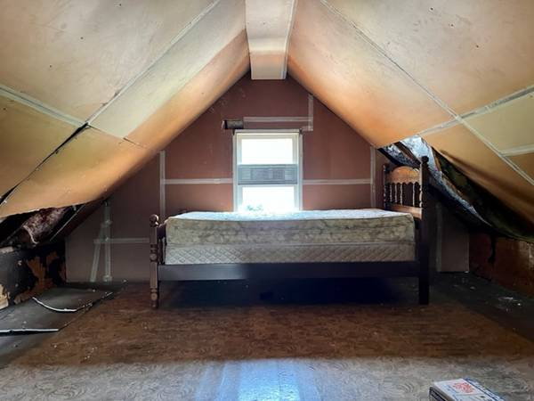

# Container 1 - Scraping Container

## Table of Contents
1. [Purpose](#purpose)
2. [Search Criteria Variables](#search-criteria-variables)
3. [Output Structure](#output-structure)
4. [Example Output Images](#example-output-images)
5. [How to Use](#how-to-use)
   - [Build and Upload Docker Image](#build-and-upload-docker-image)
   - [Create GCP VM Instance](#create-gcp-vm-instance)
   - [Set Up VM Environment](#set-up-vm-environment)
   - [Transfer Secrets to VM](#transfer-secrets-to-vm)
   - [Build and Push Docker Image](#build-and-push-docker-image)
   - [Run the Docker Image](#run-the-docker-image)
   - [Using the CLI](#using-the-cli)
6. [Example CLI Usage](#example-cli-usage)

## Purpose
The purpose of this container is to scrape Craigslist for images of `renovated` and `unrenovated` homes for training a Convolutional Neural Network (CNN) model.

## Search Criteria Variables
Variables for modifying search criteria:
- Text keywords
- Number of pages to scrape
- Website link to scrape from

## Output Structure
This container will output two folders:
- `renovated`
- `fixer_uppers`

Each folder will contain sub-folders for individual houses, which further contain images of different parts of the house (e.g., exterior, living room, etc.).


## *Example Output Images.*

Below are example pictures from two houses, one is a renovated house, the other is a fixer-upper.

### Renovated Houses

<table>
  <tr>
    <td></td>
    <td></td>
    <td></td>
  </tr>
  <tr>
    <td></td>
    <td></td>
    <td></td>
  </tr>
</table>

### Fixer Uppers

<table>
  <tr>
    <td></td>
    <td></td>
    <td></td>
  </tr>
  <tr>
    <td></td>
    <td></td>
  </tr>
</table>


## How to use

### Build, Tag, and Push Docker Image to Docker Hub
1. Execute `use build-tag-docker-image.sh`
   - Builds the `c1-data-scraping` image using the `Dockerfile`
   - Tags it as `ms3-0-1`
   - Pushes to Docker Hub under the username `tonyahu`

> **Note:** Replace `tonyahu` with your own Docker Hub username.


### Create GCP VM Instance
1. Navigate to [Google Cloud Console](https://console.cloud.google.com/)
2. Create a new VM instance
3. Configure a standard medium machine (no GPU required for this container)

![[Screenshot 2023-10-05 at 6.35.20 PM.png]]
4. start the virtual machine and use SSH in browser to see it!

### 3. Set up virtual machine!
1. Next step is to 
	1. Update the virtual machine
	2. Install docker
	3. Set up secrets folder directory
	4. Set up read write permissions
2. run the following commands to update the environment. Alternatively, this can be saved as a shell file to automatically run!

```bash
#!/bin/bash

# update the VM
sudo apt-get update

# download docker sh to the VM
sudo apt install docker.io 

# Add name to group
# Change to your username!
sudo usermod -a -G docker tonyhua18

# check if user has been added
grep docker /etc/group

# change user's group ID to docker (to avoid having to log out and log in again)
newgrp docker

# make an empty secrets folder for later
mkdir /secrets

# give read write access to folder
chmod a+rwx /secrets
```

### 4.  Transfer secrets from local machine to VM
1. Download Google Cloud SDK on your local machine
2. CD to local folder where Google Cloud SDK was downloaded
3. Run the following command in the Google Cloud SDK folder:  

```bash
gcloud compute scp <filepath of secrets (local)> <GCP instance name>:<destination file path>
```


### 5. Build and Push Image to Docker Hub.
1. In your local machine, Execute the script `sh build-tag-docker-image.sh` in the c1 container folder.

```bash
#!/bin/bash

# Exit immediately if a command exits with a non-zero status
set -e

# Check if already logged in to Docker Hub
if docker info --format '{{.IndexServerAddress}}' | grep 'https://index.docker.io/v1/' > /dev/null 2>&1; then
    echo "Already logged in to Docker Hub, skipping login and starting build..."
else
    echo "Not logged in to Docker Hub, login first."
    read -p "Enter your Docker Hub username: " username
    read -s -p "Enter your Docker Hub password: " password
    echo
    docker login -u "$username" -p "$password"
fi

# Build the Docker image and tag it
docker buildx build -t synx2/c1-data-scraping:ms3-0-1 --platform=linux/amd64 -f Dockerfile .
echo "Building and tagging complete."

# Push to Docker Hub - currently set to Tony's repo but change to env variables in next version.
docker push synx2/c1-data-scraping:ms3-0-1
echo "Pushed to Docker Hub!"

```

### 6. Pull the image from docker hub and run it in the VM instance.

```bash

docker login
docker pull synx2/c1-data-scraping:ms3-0-1
docker run -it --entrypoint /bin/bash -v /secrets:/secrets synx2/c1-data-scraping:ms3-0-1

```

### 7. Use the included cli.py to start scraping data
The container supports the following commands:
```bash
# scrape images from craigslist
Python cli.py -s

# upload images to google buckets
Python cli.py -u
```


### Examples Cli Usage below:

python cli.py -s (scraping)


Python cli.py -u (upload to GCS)


Results: Scraped images are in GCS!
