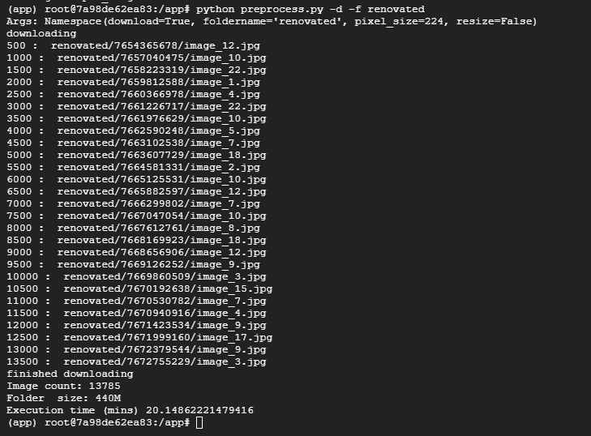
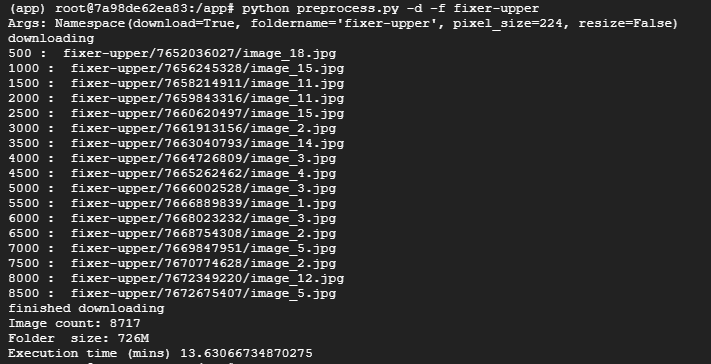
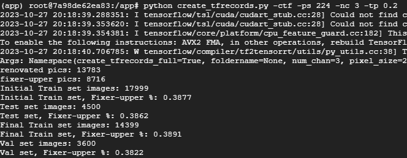
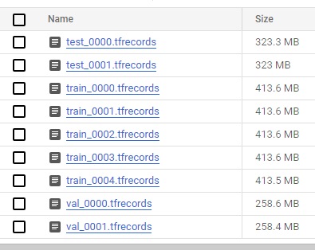
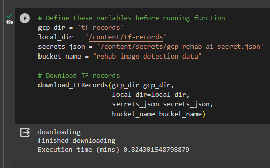
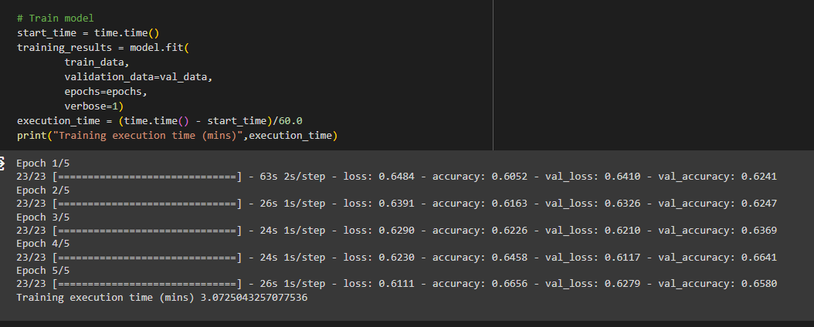
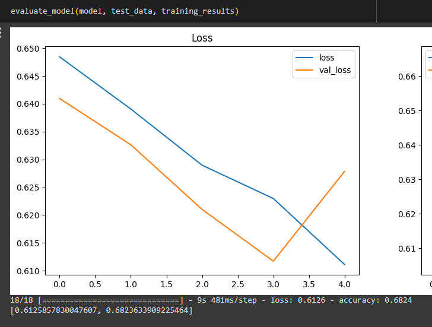
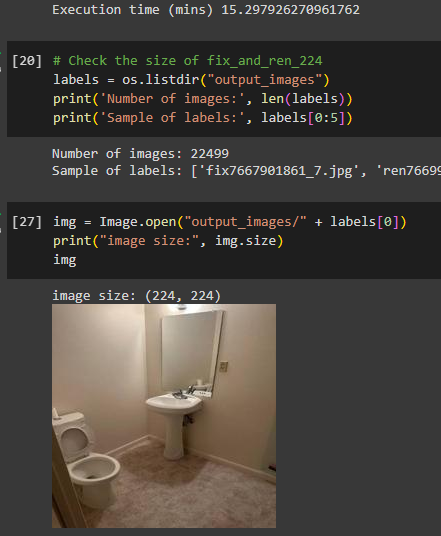

## Preprocessing Container - c2c-preprocessing 

This container downloads images from GCP bucket, resizes the images, and re-uploads to GCP bucket. 

To use this docker container, please build from the dockerfile in this folder and run the resulting docker image.

Preprocess.py has three functions: (1) to download images (-d), (2) resize images (-r).

create_tfrecords.py has two functions: (1) to create tf records (-ctf), and to upload tf-records to GCS Bucket (-u)

Total dataset is 22,499 images, with 13,783 renovated images, and 8,716 fixer-upper images. File sizes of all images together is 726MB.

Currently, the images are set to 224x224 and 3 channels for training.

When loading images from tf-records, download time is 0.82 minutes, versus raw images of 33 minutes.


## To run this on GCP VM:

### 1. Create VM instance in GCP, and SSH into VM instance

### 2. Update VM and install git
- This container requires the downloading of git and pulling a git repo from github
- A git repo is necessarily because it will be used as source tracking for dvc, and for saving changes to .dvc file later
- Run the following:
```bash
sudo apt-get update
sudo apt install git
```

### 3. Go to Github.com and create Personal Access Token
- PAT is used when you want to pull from private repos
- Make sure the PAT has read write access in the permissions for the specific repo you want to clone  

### 4. Clone git repo into VM
-  Run the following code. Update branch and repo URL as needed.  
```bash 
git clone -b milestone5 https://<insert personal access token>@github.com/wan-wingyip/AC215_rehab_image_detection_ai.git
```  

### 5. Run shell scripts to install docker and create directories:
- cd into the AC215_rehab_image_detection/c2c-preprocess folder
- run docker-install.sh and dir.sh
- docker-install.sh installs docker and updates user access
- dir.sh creates required directories and updates user access  
```bash
cd AC215_rehab_image_detection_ai/c2c-preprocessing  
sh docker-install.sh  
sh dir.sh
 ```

### 7. SCP secrets file to GCP VM to access GCS storage bucket
- Download Google Cloud SDK
- In the local Google Cloud SDK directory, run the following command:  
```bash
gcloud compute scp <filepath of secrets (local)> <GCP instance name>:<destination file path>
```

### 8. Build or pull docker image and run docker container
- You have two options: 1) build the docker image locally, 2) or pull the docker image from docker hub. If it is the first time running this container, and you don't already have the image on dockerhub, you will have to build the image locally, then push the image to docker hub, so you can pull it later.
- To build the docker image, run the following command in the c2c-preprocessing directory where the Dockerfile is located
- -t is to signify tag given to the image. The file path format is [docker username]/[repo of your choice]:[image tag name]
```bash
docker build -t wanwingyip/rehab-ai:c2c-latest -f Dockerfile .  
```
- To push to docker hub, run the following command:
```bash
docker push wanwingyip/rehab-ai:c2c-latest
```
- To pull the docker image, first login to dockerhub, then pull from dockerhub 
- Run the following commands:
```bash
docker login -u [username] -p [password]
docker pull wanwingyip/rehab-ai:c2c-latest
```
- To run docker image, run the following commands
- Change volume mount (-v) directories as needed
- Here we also mount the current working directory so that we can have access to our git repo for saving the dvc changes (if needed)
```bash
docker run -v /home/evw754/secrets:/app/secrets --rm -ti --mount type=bind,source="$(pwd)",target=/app c2c
```

### 10. Init DVC, and add to DVC registry  
- Initialize dvc
- Add remote registry to GCS bucket, change bucket destination for your bucket
```bash
dvc init --no-scm -f
dvc remote add -d output_images gs://rehab-image-detection-data/dvc-store  
```

### 11. Inside container, run the preprocess.py file to download images
- preprocess.py file can download, resize and upload images (using designated flags)
- Use -d to tell python app to download from GCP
- Use -f to specify which GCS bucket folder to download from 
- python file will automatically create a directory called input_images, and save downloaded images there
- Run preprocess.py -d twice for renovated and fixer-upper, because GCS bucket has two different olders for raw images. They will both save to input_images folder locally. 
- Folder size is cumulative, meaning will include both renovated and fixer-upper images, if downloading both
```
python preprocess.py -d -f renovated
python preprocess.py -d -f fixer-upper
```
- Total download time of 33 minutes
- 726MB for both raw renovated and fixer upper images





### 12. Inside container, run preprocess.py to resize images. 
- Use -r to tell python app to resize images
- Use -s to signify the pixel size of the image. Default is 224. Images will be 224x224.
- images will be saved to directory called output_images
```
python preprocess.py -r -ps 224
```  

### 13. Add resized images directory to DVC registry in GCS bucket
- Add dataset directory to registry
- Push Data to remote registry  
```
dvc add output_images  
dvc push
```

### 14. Push DVC updates to github
- Bring up another SSH terminal, and cd into local git repo  
```
cd AC215_rehab_image_detection_ai/c2c-preprocessing
```

- In the local repo, git add to staging, git commit and tag  
```
git add .
git commit -m 'dataset updates fix_and_ren_224'  
git tag -a 'fix_and_ren_224' -m 'tag dataset'  
```

- First, push git commits to the remote branch (one in which you are working)   
```
git push origin fix_and_ren_224  
```

- You will also need to push to the remote main repo, because DVC can only pull from main repo
- You must set remote origin/main URL to the main remote repo
- Then push commits to oring/main as well  
```
git remote add origin/main https://<insert personal access token>@github.com/wan-wingyip/AC215_rehab_image_detection_ai.git

git push origin/main fix_and_ren_224  
```

### 15. Create TF-Records 
- In container, run create_tfrecords.py:  
- -ctf flag is to create tf records
- -ps flag is to signifiy pixel size (image height and width)
- -nc flag is to signify number of channels
- -tp flag is to signify the train test split percent, for test and validation sets
```
python create_tfrecords.py -ctf -ps 224 -nc 3 -tp 0.2  
```
- the function will output the number of images each dataset
- test set imagee = 4500, with fixer-upper class= 0.39%
- train set images = 14399, with fixer-upper class= 0.39%
- val set images = 3600, with fixer-upper class= 0.38%



### 16. Upload TF-REcords to bucket  
- In container, run create_tfrecords.py -u
- -u flag is to upload to "tf-records" folder in gcs bucket
- You must have "tf-records" folder already created in the bucket 
```
python create_tfrecords.py -u  
```
- tf records successfully uploaded to GCS bucket




### 17. Colab notebook download_train_TFRecords.ipynb confirms we can download and train on TF_records from GCS Bucket
- Download time for for tf records from GCS bucket is 0.82 minutes, compared to downloading raw images of 33 minutes



- Model pulling from tf-records prefetch objects for train_data and val_data and training successfully



- Successful model evaluation on tf-record prefetch object for test_data



### 18. Colab notebook create_TFRecords.ipynb can also download images and create tf-records

### 19. Colab data_version_check.ipynb will download dataset from DVC on github and hashfile on GCS bucket

- Confirm same number of files (22,499)
- 15 minutes download time




