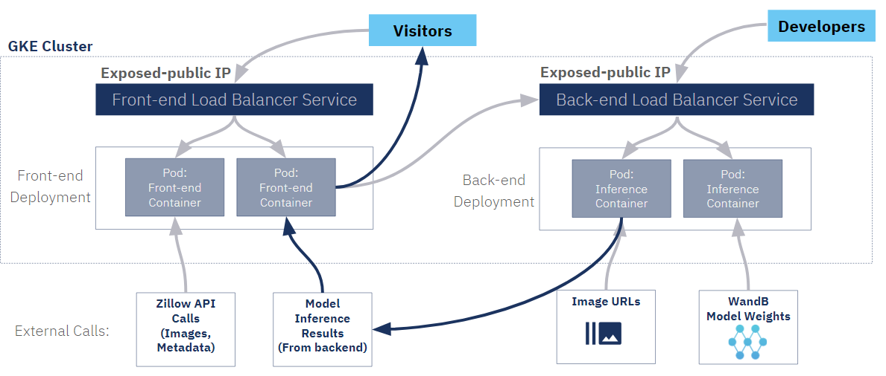
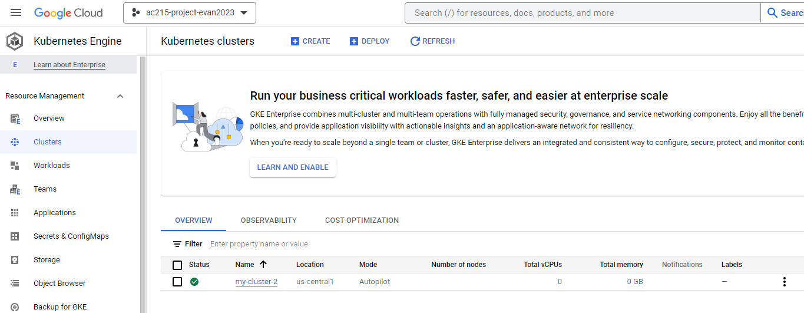

## k8s and Ansible

This folder covers our strategy for kubernetes, as well as how to run the yaml files to create the kubernetes cluster. It also includes a section on how to run ansible from your local machine to stand up a GCP instance.

### How to deploy to our app to kubernetes

For our Kubernetes cluster we decided on an architecture of two load balancer's with exposed IPs, one for the front-end and one for the back-end. Please see the sample below. 

Visitors will go through the exposed front-end load balancer IP address, which will forward traffic to the front-end pods. The front-end pods will make calls to the zillow API for image and metadata and send that information to the back-end loadbalancer. The back-end loadbalancer will distribute the image_urls received from the zillow api, and send them back-end pods for downloading and inference. Once the backend pods are finished inferencing, they will send information to the front-end containers, which will serve the information to the visitor.

With this architecture, each pod is running a single container, thus utilizing a smaller footprint and can upscale and downscale as needed without running larger VMs than is necessary compared to a two-container pod. Additionally, we have the back-end load balancer capable of exposing to the internet, in the event that we would be interested in creating an api for developers.



### 1. Create k8s cluster from console

First we go to GCP console. Then to Kubernetes Engine, and click create on the top. Then name your cluster and click done.



### 2. Open cloudshell and upload the relevant files 

Upload the following files from this directory:
- back-end.yaml
- front-end.yaml
- front-end-svc.yaml
- back-end-svc.yaml
- django-backend-config-yd6f.yaml

### 3. Create the environment variables for back-end pods 

Run the following command to create the config map for the back-end pods to communicate with WandB. This will create the WANDB_API_KEY. The api key is not included with this directory.

```bash
kubectl apply -f django-backend-config-yd6f.yaml -n default
```
### 4. Deploy backend pods 

Now we deploy the back-end pods with the Django server and model from weights and biases. Run the following command to deploy the back-end pods

```bash
kubectl apply -f back-end.yaml -n default
```

### 5. Deploy back-end service 

Now we deploy the back-end load balancer. Once the loadbalancer is deployed we wait for it to expose its external IP address.

```bash
kubectl apply -f back-end-svc.yaml -n default
```

### 6. Update the front-end config map and upload to cloudshell 

When the back-end load balancer has exposed its IP, get that IP address and update the NEXT_PUBLIC_INFERENCE_URL value in the config file react-frontend-config-g4gp.yaml. Use the following format with example URL when updating the IP: http://34.66.77.67:8000/model

This config map also has NEXT_PUBLIC_RAPID_API_KEY and NEXT_PUBLIC_REALTY_API_URL values, but are not public for this repo.

After that is updated, upload the react-frontend-config-g4gp.yaml to the cloudshell and run the following command. 

```bash
kubectl apply -f react-frontend-config-g4gp.yaml -n default
```

### 7. Deploy front-end pods 

Now we deploy the front-end pods which is a react app that will be exposed to visitors. Run the following command to deploy the front-end pods

```bash
kubectl apply -f front-end.yaml -n default
```

### 8. Deploy front-end service 

Lastly, we deploy the front-end load balancer. Run the following command to run the front-end load balancer.

```bash
kubectl apply -f front-end-svc.yaml -n default
```

### 9. Check front-end load balancer is serving the website correctly. 

Once the front-end service is deployed, wait for the cluster to expose its external IP address. Once that is open, open the browser and type in that IP address. The website should now be running.


If all goes well, you will see your cluster running with services for front end and backend containers separately! 


## View your deployment's metrics and performance!
To view your deployment's metrics and performance, Google Kubernetes Engine also provides amazing query and monitoring tools as well. Here are images of what the dashboard looks like, and examples of how you can monitor your builds as well.

#### Metrics Explorer


## To run ansible:

### 1. Create Service Account for deployment

This readme will not go over how to create GCP service account. To see full details, please go to https://github.com/dlops-io/mushroom-app-v3/tree/main.

Once you have your deployment and gcp-service json, create a secrets folder to store the json files.

### 2. Create container for ansible

In this directory, run the following shell file to create and run docker container that will run ansible. If running windows run docker-shell.bat. Be sure to change the environment variables and file paths in docker-shell.sh and Dockerfile to match your environment.

```bash
sh docker-shell.sh
```
### 2. SSH Setup
Inside the container, run the following commands
```bash
gcloud compute project-info add-metadata --project <YOUR GCP_PROJECT> --metadata enable-oslogin=TRUE
```

### 3. Create SSH secret keys in the secrets folder
cd to the secrets folder inside the container, and run the following command to create ssh keys for your service account.

```bash
cd /secrets
ssh-keygen -f ssh-key-deployment
cd /app
```

### 4. Provide the generated SSH to instances

```bash
gcloud compute os-login ssh-keys add --key-file=/secrets/ssh-key-deployment.pub
```
From the output of the file make note of the username, and add that username to the inventory.yml file. Make sure to change the variables in the inventory.yml file to match your environment. 

### 5. Creation of GCP instance
To create an instance run the following command inside the local ansible container. Now you have an ansible container that is able to deploy to GCP. Once your instance is up, go to the GCP console to get the external IP. Use that to update the variables in the inventory.yml file.

```bash
ansible-playbook deploy-create-instance.yml -i inventory.yml --extra-vars cluster_state=present
```


