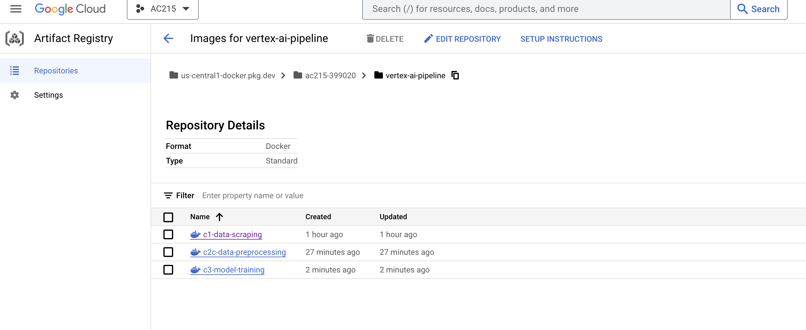
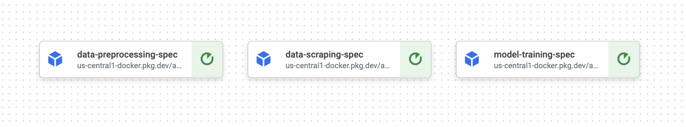

# About
This workflow allows us to easily manipulate our entire ML pipeline from a single `cli.py` file versus instantiating multiple containers and inputting args from multiple `cli.py` instances.

This part of the project consolidates the separate micro services and fully connects the pipeline, creating a dashboard to easily observe and invoke services.


### Overview of Rehab AI's pipeline components
In our pipeline, we have the following microservices built from previous milestones:
1. data scraping microservice (container c1)
2. data pre-processing microservice (container c2c)
3. model training (container c3)

These components can be optionally augmented with additional micro services such as model serving, web appl backend, and webapp front end in future milestones.

# Usage

### How to run the workflow Vertex AI:

#### Prerequisites:
1. make sure you are logged into gcloud and docker
```bash
gcloud auth configure-docker us-east1-docker.pkg.dev
```

#### Usage
1. On your local machine, CD into the workflow folder and run the following commands to start the workflow!
```bash
# COMMANDS TO START REHAB AI WORKFLOW

# to scrape images only
python cli.py -s

# to preprocess images only
python cli.py -p

# to train model only
python cli.py -t

# to run entire pipeline
python cli.py -all
```


# How to set up Vertex AI Pipeline

### Overview of Steps
1. Make all docker images callable
2. Push docker images to Google Artifact Registry
3. Design a pipeline with Kubeflow & push to Vertex AI, using the previously created docker images as components in the pipeline
4. Run the pipeline locally via `cli.py`!

### Step 1 - Make existing Docker Images callable
- Before, all our container `ENTRYPOINTS` were set at `["pipenv", "shell"]`
- In our new docker images, we rewrite the docker files such that the `ENTRYPOINT` is now pointed to a bash file that executes immediately upon container deployment, versus waiting for users to call `python cli.py [args]`
- for example:
	- change ENTRYPOINT from ["pipenv", "shell"] to  ["/bin/bash", ".docker-entrypoint.sh"] in all Docker files.

```bash
# Old ENTRYPOINT
ENTRYPOINT ["pipenv", "shell"] 

# New ENTRYPOINT
ENTRYPOINT ["/bin/bash", ".docker-entrypoint.sh"]
```

### Step 2 - Pushing existing Docker Images to Google Artifact Registry

#### Prerequisites
1. Before following these next steps, make sure to have the following set up first!
	1. a Docker Hub repo
	2. a Google Artifact Registry Repo
		1. note: the artifact registry repo should be instanced in the same region as your storage bucket and Vertex AI location (ex: us-centra1)


#### Pushing the image to Artifact Registry
1. Authenticate to GCloud first.

The syntax is as follows:
```bash
gcloud auth configure-docker <Location>-docker.pkg.dev
```

For example, with a Google Artifact Registry located in: `us-central1`
the command will be:
```bash
gcloud auth configure-docker us-central1-docker.pkg.dev
```


2. build your docker image locally, using a `.sh script` or using the command:
```bash
docker build -f Dockerfile
```

3. Tag the image with the following syntax in your command line:

Syntax:
```bash
docker tag <image id> <GCP Location>-docker.pkg.dev/<GCP project name>/<repo name>/<image name>
```

For example w/ the following paramenters:
- Docker image ID: 621dwasd99a21ea6
- Google Artifact Repo Location: us-central1
- GCP Project ID: ac215-399020
- Google Artifact Registry Repo name: vertex-ai-pipeline
- Image name: c1-scraping
```bash
docker tag 621dwasd99a21ea6 us-central1-docker.pkg.dev/ac215-399020/vertex-ai-pipeline/c1-scraping
```

4. push the built and tagged image to Google Artifact Registry

Syntax:
```bash
docker push <Location>-docker.pkg.dev/<project name>/<repo name>/<image name>:<tag>
```

Example:
```bash
docker push us-central1-docker.pkg.dev/ac215-399020/vertex-ai-pipeline/c1-scraping:latest
```


Alternatively, use the prewritten `build-tag-artifact-reigstry.sh` script in each container's folder to automatically build, tag, and push!

Logging into the Google Artifact Registry, you should see this:



Note that the container URI is defined as: `<REGION>-docker.pkg.dev/<PROJECT_ID>/<REPOSITORY_NAME>`

### 3. Designing the ML Workflow w/ Kubeflow and Vertex AI

For our ML workflow, we have 3 previously created components:
1. data scraping microservice (container c1)
2. data pre-processing microservice (container c2c)
3. model training (container c3)

For simplicity, we currently only support running each container separately or running the entire pipeline at once sequentially.

For future implementations, we can modify each container's `cli.py` file to expose more arguments or to accept input parameters too, allowing additional flexibility for our pipeline. 

### 4. Run the workflow
1. On your local machine, CD into the workflow folder and run the following commands to start the workflow!
```bash
# COMMANDS TO START REHAB AI WORKFLOW

# to scrape images only
python cli.py -scrape

# to preprocess images only
python cli.py -preprocess

# to train model only
python cli.py -train

# to run entire pipeline
python cli.py -all
```

2. After pressing enter, you will see `.yaml` files being created for each particular workflow requested. Additionally, the console will also reveal a link when the job is uploaded: 

For example: `https://console.cloud.google.com/vertex-ai/locations/us-central1/pipelines/runs/run-all-components-20231028021750?project=737549149677`


When visiting the link and viewing the job, you should see something like so!




# Next steps
- We will continue improving the pipeline by exposing more arguments from each container, allowing the end users to create more detailed pipelines (ex: run only the TF records or resizing workflow independently versus running the entire preprocessing workflow)
- We also want to expose URL endpoints so we can access containers from other applications, like our front end web application.